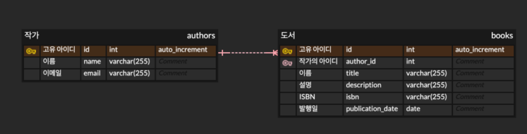

### 데이터베이스 설계

 
 

### Swagger 접속 주소
http://localhost:11000/swagger-ui/index.html
 
 

### 빌드 방법(MAC or LINUX 기준입니다.)
1. 루트폴더로 이동
2. ./gradlew :container:build 명령어 입력 (Java가 설치되어 있어야 합니다.)
3. java -jar ./container/build/libs/container.jar 명령어 입력
 
 

### 사용한 구조
#### Hexagonal Architecture
https://seungkyu.tistory.com/64
 
제 블로그에 관련 설명이 있습니다.
 
 

### Swagger 사용방법
설명에 맞추어 json or query에 값을 넣고
 

 
해당 버튼을 클릭하면 http를 사용해 API가 호출됩니다.
 
 

### 기능 유의사항
작가와 책의 관계로 인해 책이 남아있는 작가를 삭제할 수 없고, 없는 작가를 사용해 책을 등록할 수 없습니다.
만약 위와 같은 시도를 한다면, 충돌에 해당하는 409 or 찾을 수 없다는 404의 http 에러가 반환됩니다.

- 작가 등록 
기존에 존재하는 이메일을 사용해 이메일을 등록할 경우, 충돌에 해당하는 409에러가 반환됩니다.

- 작가 조회 
존재하지 않는 작가의 아이디를 사용해 조회하는 경우, 404에러가 반환됩니다.

- 작가 정보 수정 
해당 아이디에 해당하는 작가가 존재하지 않을 경우 찾을 수 없다는 404 에러가 반환됩니다.
다른 작가가 사용하는 이메일을 사용해 이메일을 등록할 경우, 충돌에 해당하는 409에러가 반환됩니다.

  
- 작가 정보 삭제 
해당 작가의 도서가 남아있을 경우 충돌에 해당하는 409에러가 반환됩니다.

- 도서 등록 
존재하지 않는 작가의 아이디로 검색하는 경우 404에러가 반환됩니다.

- 도서 조회 
존재하지 않는 도서의 아이디를 사용해 조회하는 경우, 404에러가 반환됩니다.

- 도서 정보 수정 
해당 아이디에 해당하는 도서가 존재하지 않을 경우 찾을 수 없다는 404 에러가 반환됩니다.
존재하지 않는 작가로 수정하는 경우 404에러가 반환됩니다.

- 도서 정보 삭제 
해당 도서가 존재하지 않는 경우 404에러가 반환됩니다.
